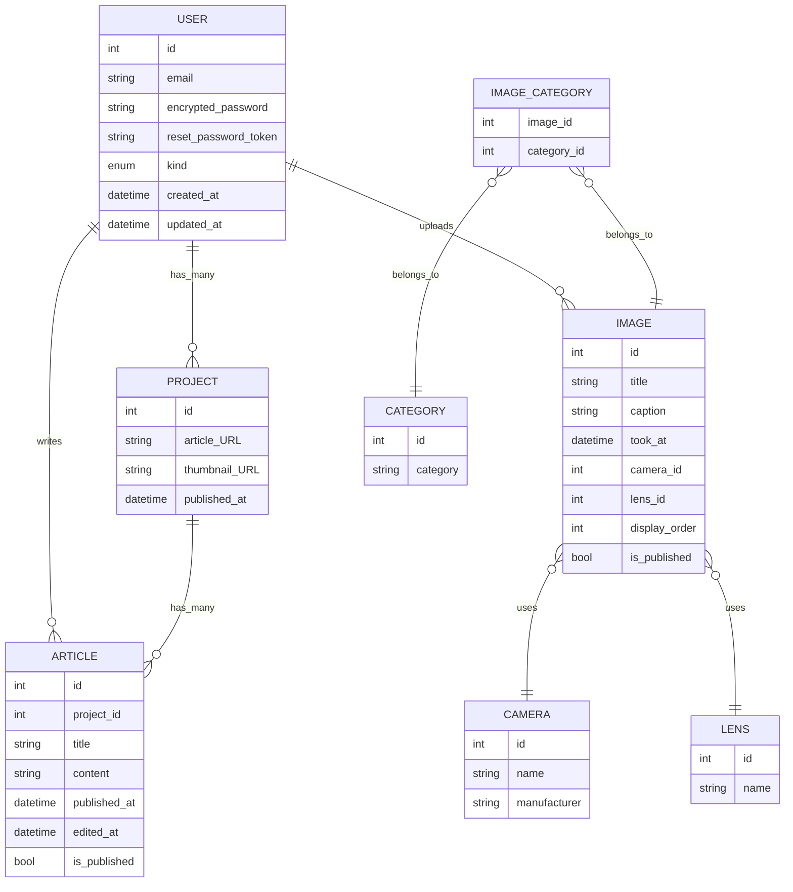

# portfolio

## Model

```mermaid
erDiagram
   USER ||--o{ PROJECT : has_many
  USER ||--o{ ARTICLE : writes
  PROJECT ||--o{ ARTICLE : has_many
  USER ||--o{ IMAGE : uploads
  USER{
    int id
    string email
    string encrypted_password
    string reset_password_token
    enum kind
    datetime created_at
    datetime updated_at
  }
  PROJECT{
    int id
    string article_URL
    string thumbnail_URL
    datetime published_at
  }
  ARTICLE{
    int id
    int project_id
    string title
    string content
    datetime published_at
    datetime edited_at
    bool is_published
  }
  IMAGE }o--|| CAMERA : uses
  IMAGE }o--|| LENS : uses
  IMAGE{
    int id
    string title
    string caption
    datetime took_at
    int camera_id
    int lens_id
    int display_order
    bool is_published
  }
  LENS{
    int id
    string name
  }
  CAMERA{
    int id
    string name
    string manufacturer
  }
  IMAGE_CATEGORY }o--|| CATEGORY : belongs_to
  IMAGE_CATEGORY }o--|| IMAGE : belongs_to
  CATEGORY{
    int id
    string category
  }
  IMAGE_CATEGORY{
    int image_id
    int category_id
  }
```
