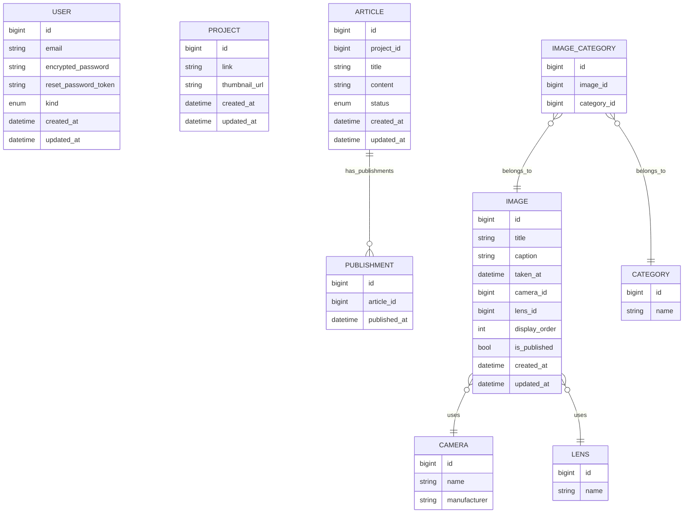

# portfolio

## Model

```mermaid
erDiagram
  USER{
    bigint id
    string email
    string encrypted_password
    string reset_password_token
    enum kind
    datetime created_at
    datetime updated_at
  }
  PROJECT{
    bigint id
    string link
    string thumbnail_url
    datetime created_at
    datetime updated_at
  }
  ARTICLE ||--o{ PUBLISHMENT : has_publishments
  ARTICLE{
    bigint id
    bigint project_id
    string title
    string content
    enum status
    datetime created_at
    datetime updated_at
  }
  PUBLISHMENT{
    bigint id
    bigint article_id
    datetime published_at
  }
  IMAGE }o--|| CAMERA : uses
  IMAGE }o--|| LENS : uses
  IMAGE{
    bigint id
    string title
    string caption
    datetime taken_at
    bigint camera_id
    bigint lens_id
    int display_order
    bool is_published
    datetime created_at
    datetime updated_at
  }
  LENS{
    bigint id
    string name
  }
  CAMERA{
    bigint id
    string name
    string manufacturer
  }
  IMAGE_CATEGORY }o--|| CATEGORY : belongs_to
  IMAGE_CATEGORY }o--|| IMAGE : belongs_to
  CATEGORY{
    bigint id
    string name
  }
  IMAGE_CATEGORY{
    bigint id
    bigint image_id
    bigint category_id
  }
```
