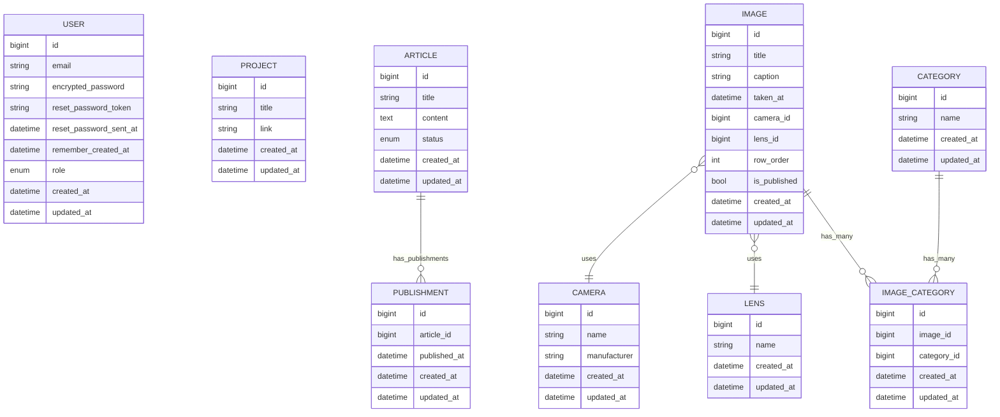

# Portfolio

## 開発環境の立ち上げ方

1. `.env` ファイルを作成し、以下の内容を記載

   ```env
   POSTGRES_USER=backend
   POSTGRES_PASSWORD=password
   POSTGRES_DB=backend_development
   PGHOST=db
   ```

2. Dockerイメージのビルド

   ```bash
   docker-compose build
   ```

3. コンテナの起動

   ```bash
   docker-compose up -d
   ```

4. ユーザーの作成（http://localhost:3000/users/sign_up でサインアップ）

5. ユーザーを管理者に変更

   ```bash
   docker-compose exec backend rails console
   ```

   ```ruby
   User.last.update!(role: "admin")
   ```

### URL(開発環境)

- フロントエンド: http://localhost:3002
- 管理画面（画像管理）: http://localhost:3000/admin/images
- ユーザー登録画面: http://localhost:3000/users/sign_up

## データベース設計


