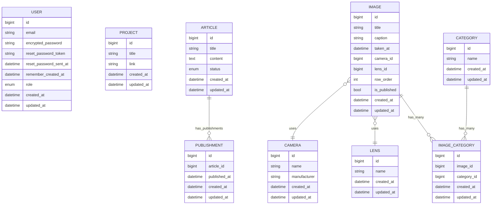

# Portfolio

## 開発環境の立ち上げ方

1. 環境変数の設定

   サンプルを参考に以下で環境変数を導入
   - .env
   - backend/.env.development
   - frontend/.env.local

2. Dockerイメージのビルド・起動

   ```bash
   docker compose build
   docker compose up -d
   ```

3. ユーザーの作成（http://localhost:3000/users/sign_up でサインアップ）

4. ユーザーを管理者に変更

   ```bash
   docker compose exec backend rails console
   ```

   ```ruby
   User.last.update!(role: "admin")
   ```

### URL(開発環境)

- フロントエンド: http://localhost:3002
- 管理画面（画像管理）: http://localhost:3000/admin/images

## データベース設計


```mermaid
erDiagram
  USER{
    bigint id
    string email
    string encrypted_password
    string reset_password_token
    datetime reset_password_sent_at
    datetime remember_created_at
    enum role
    datetime created_at
    datetime updated_at
  }
  PROJECT{
    bigint id
    string title
    string link
    datetime created_at
    datetime updated_at
  }
  ARTICLE ||--o{ PUBLISHMENT : has_publishments
  ARTICLE{
    bigint id
    string title
    text content
    enum status
    datetime created_at
    datetime updated_at
  }
  PUBLISHMENT{
    bigint id
    bigint article_id
    datetime published_at
    datetime created_at
    datetime updated_at
  }
  IMAGE }o--|| CAMERA : uses
  IMAGE }o--|| LENS : uses
  IMAGE{
    bigint id
    string title
    string caption
    datetime taken_at
    bigint camera_id
    bigint lens_id
    int row_order
    bool is_published
    datetime created_at
    datetime updated_at
  }
  LENS{
    bigint id
    string name
    datetime created_at
    datetime updated_at
  }
  CAMERA{
    bigint id
    string name
    string manufacturer
    datetime created_at
    datetime updated_at
  }
  IMAGE ||--o{ IMAGE_CATEGORY: has_many
  CATEGORY ||--o{ IMAGE_CATEGORY: has_many
  CATEGORY{
    bigint id
    string name
    datetime created_at
    datetime updated_at
  }
  IMAGE_CATEGORY{
    bigint id
    bigint image_id
    bigint category_id
    datetime created_at
    datetime updated_at
  }
```
